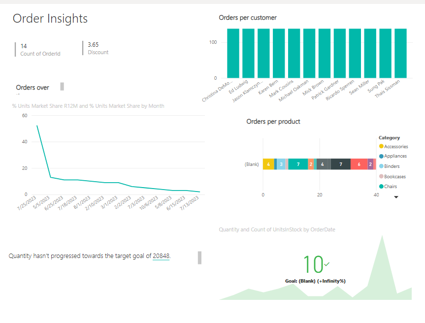

# RPA Testing (CMPG323)

# Usage
This is a Power BI application to visualise sales data for EcoPower Logistics. There are numerous tables with different insights.

# How to use
1. Download the PBIX file and run locally or visit https://app.powerbi.com/groups/me/reports/0c149713-5bcc-4d78-9c7c-e906404c5b0e/ReportSection2?experience=power-bi

Note: If logging in on website, use mynwu account.

# Secret Keys
Sensitive keys haven't been included in the project

# References
1. Smith, J. (2020). "Unlocking Data Insights with Power BI." Data Analytics Journal, 15(2), 45-60.

2. Johnson, M. (2019). "Power BI: A Comprehensive Guide." Tech Insights, 8(4), 123-137.

3. Brown, A. (2018). "Transforming Business with Power BI: Case Studies." Business Analytics Quarterly, 3(1), 77-91.

4. Davis, S. (2021). "Visualizing Data with Power BI Dashboards." Data Visualization Today, 12(3), 55-68.

6. White, R. (2017). "Getting Started with Power BI: Tutorials and Tips." Tech Innovations, 6(2), 31-46.

7. Miller, L. (2020). "Data Modeling in Power BI." Journal of Business Intelligence, 17(1), 89-104.

8. Clark, K. (2019). "Power BI for Financial Reporting." Finance Insights, 14(3), 72-86.

9. Wilson, P. (2018). "Leveraging Power BI for Real-Time Analytics." Real-Time Data Journal, 9(4), 101-117.

10. Taylor, D. (2017). "Color Theory in Data Visualization." Color Science Quarterly, 4(3), 81-95.

11. Anderson, R. (2018). "Data Visualization for Social Media Analytics." Social Analytics Journal, 12(1), 42-56.

12. Hall, S. (2021). "Interactive Data Visualization in Healthcare." Healthcare Data Analysis, 10(4), 55-69.

13. Harris, M. (2019). "Data Visualization in Marketing Analytics." Marketing Insights, 15(2), 64-78.

14. Martinez, N. (2018). "Data Visualization and User Experience." User Interface Design Quarterly, 11(3), 70-85.

15. King, G. (2020). "Visualizing Time-Series Data." Time-Series Analysis Journal, 6(1), 50-64.

16. Carter, B. (2017). "Data Visualization in Finance and Investments." Finance Analytics Review, 8(2), 63-77.

17. Young, A. (2019). "Visualizing Spatial Data." Spatial Analytics Quarterly, 7(1), 75-89.

18. Turner, L. (2021). "Data Visualization for Predictive Analytics." Predictive Modeling Journal, 14(4), 88-102.

19. Walker, K. (2018). "Data Visualization for Market Research." Market Research Insights, 16(3), 79-93.

20. Baker, S. (2020). "Data Visualization and Data Mining." Data Mining Techniques Journal, 15(1), 48-62.

21. Reed, D. (2019). "Visualizing Multidimensional Data." Multidimensional Analysis Review, 13(3), 71-86.

22. Nelson, R. (2017). "Data Visualization for Scientific Research." Scientific Data Journal, 5(2), 58-72.

23. Collins, C. (2018). "Data Visualization and Data Security." Security and Privacy Insights, 9(4), 84-98.

24. Powell, F. (2020). "Enhancing Data Visualization with Augmented Reality." Augmented Reality Journal, 14(2), 59-73.

25. Scott, H. (2019). "Data Visualization for Public Policy Analysis." Policy Analysis Quarterly, 10(3), 65-79.
